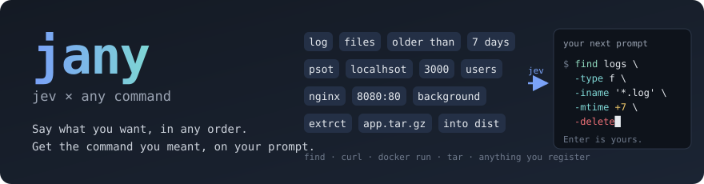
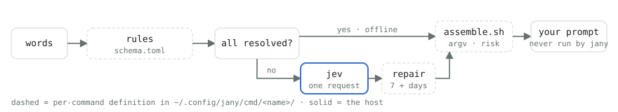

<p align="center">
  
</p>

<p align="center">
  <a href="https://crates.io/crates/jany"></a>
  <a href="https://crates.io/crates/jany"></a>
  <a href="LICENSE"></a>
  <a href="https://github.com/yukihirop/jany/actions/workflows/ci.yml"></a>
  
</p>

<p align="center">
  <b>jany</b> turns a loose pile of words — out of order, half-remembered, misspelled — into the command line you meant, and puts it on your prompt. <b>It never runs it.</b> Enter is yours.
</p>

> [!NOTE]
> **Status: experimental.** The command definitions and shell integrations may change before 1.0.

<p align="center">
  
</p>

```sh
$ jany find log files older than 7 days in logs delete
this command is destructive.
$ find logs -type f -iname '*.log' -mtime +7
  logs/old-access.log
  logs/kernel.log
  logs/system.log
  … 2 more

$ find logs -type f -iname '*.log' -mtime +7 -delete█
```

The last line is not output. It is your **next prompt, already filled in**. jany prints one shell-quoted line on stdout, and the wrapper from `jany --init zsh` puts it on the command line. Read it, edit it if you like, press Enter.

```sh
$ jany curl psot localhsot 3000 users first_name amanda      # typos, a bare port, key value as two words
$ curl -sS -X POST http://localhost:3000/users -H 'Content-Type: application/json' -H 'Accept: application/json' --data '{"first_name":"amanda"}'

$ jany docker run nginx 8080:80 background named web
$ docker run -d --name web -p 8080:80 nginx

$ jany tar extrct app.tar.gz into dist strip 1                # a definition written by the /jany-register skill
$ tar -xf app.tar.gz --strip-components 1 -C dist

$ jany find empty folders depth 2 count
$ find . -maxdepth 2 -type d -empty | wc -l
```

jany generalises [jind](https://github.com/yukihirop/jind) (jev × find) and [jurl](https://github.com/yukihirop/jurl) (jev × curl) into one binary. Each command is a **definition directory** — three files, no Rust — and adding a command is a job for an LLM skill, not a new crate.

## How it works

<p align="center">
  
</p>

- **rules** — the unambiguous shapes are decided by data in `schema.toml`: paths, globs, `8080:80`, `KEY=value`, `+7d`, `>10M`, table words like `files`/`delete`/`background`. If every word resolves, jany never leaves your machine.
- **jev** — anything left over goes to [jev](https://openrouter.ai) (TypeSafe System One, via OpenRouter) in **one request**: "what is the role of each word?" plus the extra questions the schema declares (which unit? at least or at most? a typo of which table word?). jev only picks from fixed choices and returns probabilities; it never generates the command.
- **repair** — fixes what jev cannot see word by word: attach `days` to `7`, let `except` claim the names after it, pair `first_name amanda` into key and value.
- **assemble.sh** — the command's own script (stdin JSON → stdout JSON) turns the role-tagged words into `argv`. It also says how risky the result is.
- **output** — the line goes to stdout, everything else to stderr. Below a confidence floor jany prints nothing and exits non-zero. A `dangerous` result (find `-delete`) is previewed first with a read-only run. An `unsafe` one (curl `DELETE`, docker `--privileged`) gets a one-line note.

One jev call is 200–700 ms and under $0.0001.

## Setup

```sh
cargo install jany          # after the crates.io release
# Before the release, install from this checkout:
cargo install --path .
jany --setup                  # store your OpenRouter API key in ~/.config/jany/config.toml (0600)
echo 'eval "$(jany --init zsh)"' >> ~/.zshrc     # bash and fish too; bash is untested
# optional: use `j` as a personal alias for `jany`, with the same completion
printf '%s\n' "alias j='jany'" 'compdef _jany_complete j' >> ~/.zshrc
```

`jany --init` does three things: prints the wrapper function, installs the built-in definitions (`find`, `curl`, `docker run`) into `~/.config/jany/cmd/`, and installs the `/jany-register` skill into `~/.agents/skills/` (linked from `~/.claude/skills/` and `~/.codex/skills/` when those exist). It never overwrites a definition you have edited. The skill is in English by default; `jany --init zsh --locale ja` installs the Japanese one (put the flag in your rc line, since `--init` rewrites the skill on every shell start).

`OPENROUTER_API_KEY` in the environment takes precedence; a key saved by `jind setup` or `jurl setup` is picked up too. Tested on macOS with zsh.

## Usage

```
jany <command> [words ...] [flags] [-- passthrough args]
```

| flag | |
|---|---|
| `--explain` | per-word role, confidence, and whether a rule or jev decided it (stderr) |
| `--no-jev` | offline only; unresolved words are an error |
| `--hint` | what you can say to `<command>` (its roles) and examples from its `cases.toml` (stderr) |
| `-- …` | passed through untouched (what that means is up to the command: find options, curl flags, the container command for docker run) |

jany's own actions are flags, so `<command>` is always the tool's name:

| | |
|---|---|
| `jany --list` | the definitions found, with an example each |
| `jany --test find` | run a definition's `cases.toml` (jev answers are mocked) |
| `/jany-register tar` | create and fill `~/.config/jany/cmd/tar/` with the agent skill |
| `jany --init zsh\|bash\|fish` | the wrapper, plus built-ins and the skill (`--locale en\|ja`, default `en`) |
| `jany --setup` | save the API key |

## Adding a command

```sh
jany --register tar           # optional: scaffold only, without the skill
/jany-register tar            # in Claude Code or Codex: create, fill, and test the definition
jany --test tar
```

A definition lives in `~/.config/jany/cmd/<name>[/<sub>]/`:

| file | |
|---|---|
| `schema.toml` | roles (what jev may choose from), word tables, rules, questions for jev, repair steps, risk settings |
| `assemble.sh` | role-tagged tokens in, `{argv, preview, risk, pipe, error}` out; any language, bash + jq is enough |
| `cases.toml` | words → expected argv, with jev's answers written down; `jany --test` refuses answers to questions jany did not ask |

The skill reads a reference of every schema key and the two worked examples (`find`, `curl`) before writing. The rule of thumb from jind and jurl carries over: cover the 80 % you actually type, pass the rest through after `--`, and do not trust an `assemble.sh` that has no cases.

## Config (optional)

`~/.config/jany/config.toml`

```toml
[jev]
model = "typesafe/jev-1.13"
reject_below = 0.5           # below this, print nothing and exit non-zero

[cmd.curl.defaults]          # overrides the schema's [defaults]
content_type = "text/plain"

[cmd.find.aliases]
dl = "~/Downloads"
```

## Where it is weak

- The same weaknesses as jind and jurl: a bare word (`log`, `app`) can be two roles at once, and jev is often only 0.6–0.9 sure. Write the unambiguous form (`*.log`) to skip jev.
- Commands whose vocabulary does not close — arbitrary SQL, jq programs, ffmpeg filter graphs — are not a fit. Cover the common forms and pass the rest through.
- Every word, including ones the rules already decided, is sent to jev as context. Roles that may carry secrets (curl headers, docker `KEY=value`) declare a `mask` so only a placeholder goes out.

---

<p align="center"><sub>Sister projects: <a href="https://github.com/yukihirop/jind">jind</a> (jev × find) and <a href="https://github.com/yukihirop/jurl">jurl</a> (jev × curl) — jany is their generalisation. <code>examples/</code> holds the built-in definitions and <code>docs/HOST.md</code> the line between what the host does and what a schema does. Each module in <code>src/</code> starts with a comment on what it does. <code>docs/demo.svg</code> is real output captured through a pty by <code>docs/capture-demo.py</code> and rendered by <code>docs/make-demo.py</code>. The jev wire format follows eg-jev's <code>packages/recipes/src/lib/{openrouter,questions}.ts</code>.</sub></p>
