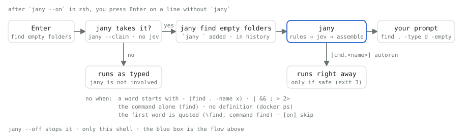

# セットアップ

ここに書いたのは、`/jany-setup` が代わりにやることと、後から on にできるもの。[README に戻る](../README.ja.md)

## 手で設定する

```sh
cargo install jany            # チェックアウトからなら cargo install --path .
jany --setup                  # OpenRouter の API キーを ~/.config/jany/config.toml(0600)に保存
echo 'eval "$(jany --init zsh --locale ja)"' >> ~/.zshrc     # bash と fish もある。bash は未検証
# 任意: エイリアスにも同じ補完と薄い候補が付く(zsh)。コマンド名まで含めたものでもよい
printf '%s\n' "alias j='jany'" "alias jpnpm='j pnpm'" >> ~/.zshrc
```

`jany --init` は 3 つのことをする: ラッパー関数を出力する、組み込みの定義(`find`、`curl`、`docker run`)を `~/.config/jany/cmd/` に置く、`/jany-setup`、`/jany-register`、`/jany-update` のスキルを `~/.agents/skills/` に置く(`~/.claude/skills/` と `~/.codex/skills/` があればそこからリンクする)。すでにある定義は上書きしない。スキルは既定で英語版。日本語版は `--locale ja` で置く。`--init` はシェルを開くたびにスキルを書き直すので、フラグは rc の行に書いておく(上の例のように)。

`jany --skills` はスキルだけを置く。最初の `--init` の前に `/jany-setup` を使うためのもの。`/jany-setup` は API キーを読まない。無ければ `jany --setup` を打つよう言う。

## 薄い候補(zsh)

zsh では、`jany <command> ` の後ろに、まだ言えることを薄く出す(定義の `[[placeholders]]`)。例: `jany find src ` → `<file|dir> <*.log> <older than N days> <delete|count>`。jev は呼ばない。`~/.config/jany/config.toml` に `[suggest] enabled = false` と書くと消える。`JANY_SUGGEST=0` / `1` はそのシェルだけ上書きする。bash と fish には無い。

## autorun(zsh)

`~/.config/jany/config.toml` に `[cmd.<name>] autorun = true` を書くと、zsh のラッパーが行を入力行に置かずにそのまま実行する。ただし、全部の語が規則で決まり、定義が risk `"none"` を返したときだけ(jev 無し、`--` の後ろ無し、生の `-x` フラグ無し、preview / pipe 無し)。ほかに何も無い `jany <command> -- --help` / `-- --version` も実行する。`autorun_also = ["pnpm install"]` と書くと、その語で始まる行は定義が `"unsafe"` と言っても実行する(最終的な argv の先頭を語単位で比べるので、`pnpm add react` になる `jany pnpm install react` は当たらない。`"dangerous"` は常に実行しない)。行は stderr に出し、履歴にも残る。それ以外は今までどおり入力行に置く。既定は off。bash / fish は常に入力行。

## jany --on(zsh)

`jany --on`(zsh だけ)を打つと、`jany --off` までそのシェルでは `jany` を省ける。Enter を押したとき、定義のあるコマンドで始まり、その後に何か言っている行は jany を通る。`find empty folders` なら次のプロンプトに `find . -type d -empty` が載り、履歴に残るのは `jany find empty folders`。`-` で始まる語(`find . -name x`)、パイプ、リスト、リダイレクトを含む行は打ったとおりに走る。コマンド単体(`find`)や、jany に定義の無いサブコマンド(`docker ps`)も同じ。`command find …` や `\find …` は常に打ったとおり。`~/.config/jany/config.toml` に `[on] skip = ["kubectl", "docker compose"]` と書くと、その語で始まる行(語単位で比べる)は打ったとおりに走り、薄い候補も出ない。それ以外の行には薄い候補が出る。

<p align="center">
  
</p>

## API キー

環境変数の `OPENROUTER_API_KEY` が優先される。`jind setup` や `jurl setup` で保存したキーも拾う。macOS の zsh で確認している。
